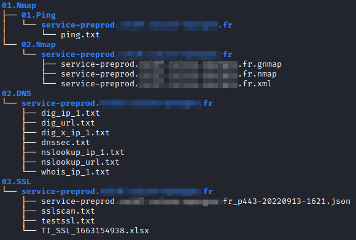

# Recon Scripts

Recon scripts for Red Team and Web blackbox auditing.

## Installation
The following command must be executed in order to install the recon.py and asset_discovery.py scripts
```
./setup.sh
```
> :warning: **Please check the global variables in each script before launching it! Be very careful here!**

## Recon.py script

### Description
Have you ever done an audit with a lot of hosts to audit and were lazy to do all the blackbox tests by hand?

I made a nice little script that does a lot of blackbox tests (Ping, Nmap, DNS+DNSSec tests, sslscan + testssl) on a set of hosts you provide to the script.

The script provides almost no output, but stores the results in different folders/files:



NB.: If your testssl script is not located in `/opt/testssl.sh/testssl.sh`, modify the path in the recon.py script.


### Usage
```
usage: recon.py [-h] [-e] [-n] [-s] -d DIRECTORY (-f HOST_LIST_FILE | -l HOST_LIST [HOST_LIST ...])

options:
  -h, --help            show this help message and exit
  -e, --extended        Run extended tests (includes SSH, FTP and HTTP tests)
  -n, --nuclei          Use Nuclei scanner to scan assets
  -s, --screenshot      Use Gowitness to take screenshots of web assets

required arguments:
  -d DIRECTORY, --directory DIRECTORY
                        Directory that will store results

mutually exclusive arguments:
  -f HOST_LIST_FILE, --filename HOST_LIST_FILE
                        Filename containing domains to scan
  -l HOST_LIST [HOST_LIST ...], --list HOST_LIST [HOST_LIST ...]
                        List of domains to scan
```


## Asset_discovery.py script

### Description
Small script that allows to do DNS asset discovery, Nuclei scans, take screenshots of found web assets by combining the output of several tools.

The script needs a root_domain to bruteforce and an output_directory as arguments.
Ex: `asset_discovery.py -d $(pwd) -l target.com -n -s`

> :warning: **In Kali Linux, do not run as root! Screenshots won't work**

### Usage
```
usage: asset_discovery.py [-h] [-n] [-s] [-w] [-g] -d DIRECTORY (-f HOST_LIST_FILE | -l HOST_LIST [HOST_LIST ...])

options:
  -h, --help            show this help message and exit
  -n, --nuclei          Use Nuclei scanner to scan found assets
  -s, --screenshot      Use EyeWitness to take screenshots of found web assets
  -w, --webanalyzer     Use Webanalyzer to list used web technologies
  -g, --gau             Use gau tool to find interresting URLs on found web assets

required arguments:
  -d DIRECTORY, --directory DIRECTORY
                        Directory that will store results

mutually exclusive arguments:
  -f HOST_LIST_FILE, --filename HOST_LIST_FILE
                        Filename containing root domains to scan
  -l HOST_LIST [HOST_LIST ...], --list HOST_LIST [HOST_LIST ...]
                        List of root domains to scan
```

## Root_domains_extractor.py script

### Description
This is a helper script that allows to extract newly found root domains by the `asset_discovery.py` script.

The script needs a root_domain file and a `domains_and_IP_list.json` file wich is obtained by executing the `asset_discovery.py` script.

### Usage
```
usage: root_domains_extractor.py [-h] -d DIRECTORY -r ROOT_DOMAINS -l DOMAIN_AND_IP_LIST

options:
  -h, --help            show this help message and exit

required arguments:
  -d DIRECTORY, --directory DIRECTORY
                        Directory that will store results
  -r ROOT_DOMAINS, --root_domains ROOT_DOMAINS
                        Filename containing root domains
  -l DOMAIN_AND_IP_LIST, --list DOMAIN_AND_IP_LIST
                        domains_and_IP_list.json file from asset_discovery.py scan
```

## WHOIS statistics

### Description
This is a helper script that allows to create a csv file containing whois statistics.
The script needs a HOST_LIST_FILE containing all the subdomains found by the `asset_discovery.py` script.

### Usage
```
usage: whois_stats.py [-h] -d DIRECTORY -f HOST_LIST_FILE

options:
  -h, --help            show this help message and exit

required arguments:
  -d DIRECTORY, --directory DIRECTORY
                        Directory that will store results
  -f HOST_LIST_FILE, --filename HOST_LIST_FILE
                        Filename containing root domains to scan
```
